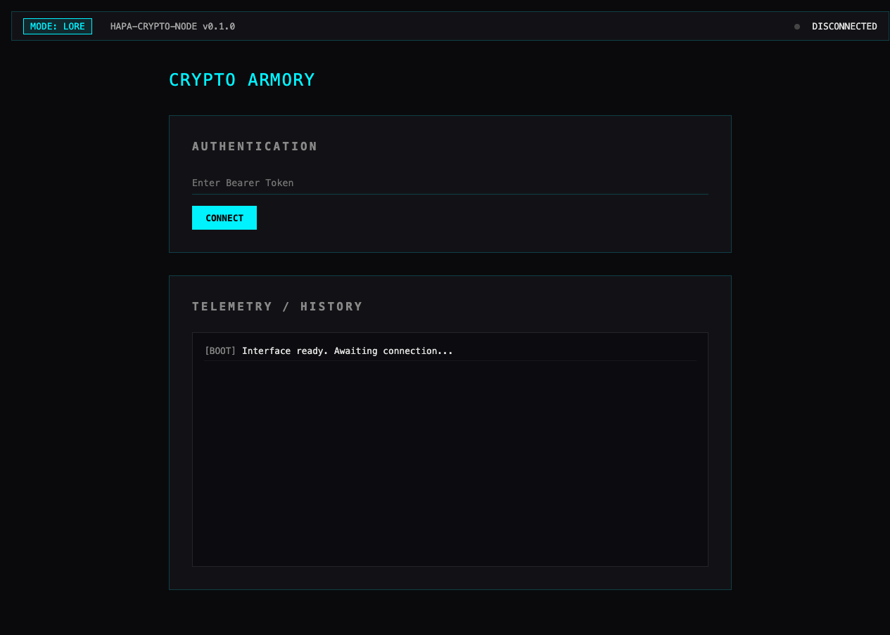

# Hapa Crypto Node

Swift-native cryptography and identity service for the Hapa.ai node ecosystem.

Verified from this repository on 2026-05-21:

- SwiftPM package name: `hapa-crypto-node`
- Products: executable `hapa-crypto-node`, library `HapaCrypto`
- Runtime stack: Swift 5.9+, macOS 14+, Hummingbird 2, Swift Argument Parser, CryptoKit
- Default bind address: `127.0.0.1`
- Default port: `8736`
- Auth: `Bearer <token>` for `/v1/*` endpoints; `/health` and `/` are public
- UI: `web/index.html`, served from `/` when launched from the repository root or with `--cwd` pointing at a directory containing `web/index.html`

## Role in Hapa

Hapa Crypto Node is the local trust and cryptography boundary for Hapa. Its job is to keep encryption, signing, hashing, key exchange, and identity key generation detached from wallet/UI layers so higher-level Hapa nodes can request cryptographic operations without owning the implementation details.

Inferred ecosystem role: trust/keys/crypto substrate for wallet, provenance, identity, and node-to-node verification workflows. This repo exposes the primitives; it does not yet prove a full wallet, NFT, or peer-to-peer runtime by itself.

Global wiki note: `../Hapa_Worldbuilding_Wiki/Nodes/Existing/hapa-crypto-node.md` (Obsidian link: `[[Nodes/Existing/hapa-crypto-node|hapa-crypto-node]]`).

## Capabilities

Implemented in `Sources/HapaCrypto` and wired through `Sources/hapa-crypto-node/App.swift`:

- AES-GCM symmetric encryption/decryption
- Ed25519 key generation, signing, and verification
- P256 key agreement/shared secret generation
- SHA-256 and SHA-512 hashing
- Token-gated HTTP control plane
- Static local dashboard for checking connection and capabilities

## HTTP interface

Default base URL:

```text
http://127.0.0.1:8736
```

Public endpoints:

- `GET /` — serves `web/index.html`
- `GET /health` — returns JSON health status

Bearer-authenticated endpoints under `/v1/*`:

- `GET /v1/capabilities`
- `POST /v1/identity/generate`
- `POST /v1/encrypt`
- `POST /v1/decrypt`
- `POST /v1/sign`
- `POST /v1/verify`
- `POST /v1/hash`
- `POST /v1/exchange`

Auth token resolution order:

1. `HAPA_CRYPTO_NODE_TOKEN` environment variable
2. `.node_token` file in the server working directory
3. Generated UUID-style token written to `.node_token`

Do not commit `.node_token`.

## CLI interface

Build:

```bash
swift build
```

Run the server:

```bash
swift run hapa-crypto-node serve --port 8736 --cwd ${HAPA_NODE_ROOT}
```

Run from an already-built debug binary:

```bash
./.build/debug/hapa-crypto-node serve --port 8736 --cwd ${HAPA_NODE_ROOT}
```

Common operations:

```bash
# Generate an Ed25519 identity
swift run hapa-crypto-node identity

# Generate a P256 key-agreement identity
swift run hapa-crypto-node identity --type p256

# Hash data
swift run hapa-crypto-node hash "Hapa Truth Invariant" --algo sha256

# Encrypt data with a 32-byte base64 key
swift run hapa-crypto-node encrypt "Secret message" --key <base64_32_byte_key>

# Sign data with a base64 Ed25519 private key
swift run hapa-crypto-node sign "Data to sign" --key <base64_private_key>
```

The executable target's ArgumentParser command name is `hapa-crypto`; SwiftPM still runs it via the product name `hapa-crypto-node`.

## Data inputs and outputs

HTTP payloads use JSON and base64-encoded cryptographic material:

- `plaintext_base64`, `ciphertext_base64`, `key_base64`, `nonce_base64`, `tag_base64`
- `data_base64`, `hash_base64`
- `private_key_base64`, `public_key_base64`, `other_public_key_base64`
- `signature_base64`
- `shared_secret_base64`

Treat all private keys, symmetric keys, bearer tokens, and shared secrets as secrets. The current CLI prints generated private keys to stdout, so redirect and store with care.

## Development and verification

Cheap checks:

```bash
swift build
swift test
```

`swift test` requires a Swift/Xcode toolchain with XCTest available. On Command Line Tools installations where `xcrun --find xctest` fails, `swift build` can still verify package compilation while XCTest execution remains blocked by local toolchain setup.

A HTTP smoke check can be run locally after starting the service:

```bash
curl http://127.0.0.1:8736/health
TOKEN="$(cat .node_token)"
curl -H "Authorization: Bearer ${TOKEN}" http://127.0.0.1:8736/v1/capabilities
```

## Repository layout

```text
Package.swift                  SwiftPM package definition
Sources/HapaCrypto/            Reusable cryptography library
Sources/hapa-crypto-node/      Executable CLI and Hummingbird server
Tests/hapa-crypto-nodeTests/   XCTest coverage for core primitives
web/index.html                 Local dashboard / Lore Mode console
CAMPFIRE.md                    Hapa-facing node context and operating notes
SECURITY.md                    Secret-handling and pre-publish safety checks
```

## License and attribution

Project-level license: MIT under `Hapa.ai / Calder Wong`. See `LICENSE`.

Contributors may optionally opt into Bananas work-contribution tracking for attribution. Bananas is an attribution/accounting layer for Hapa work contributions; it is not required to receive the MIT license grant and should not be used to restrict copying, modification, distribution, or private use under the MIT terms.

Existing third-party dependency licenses remain governed by their upstream projects and package metadata.

<!-- HAPA-README-SCREENSHOT-2026-05-22 -->

## Screenshot



Hapa Crypto Node crypto armory console.


<!-- HAPA-README-QUALITY-PASS-2026-05-22 -->

## Hapa ecosystem context

<p>
  
</p>

### Shared ecosystem pattern

Hapa is built as a constellation of modular nodes. Each node owns a focused capability, but participates in a shared protocol for provenance, handoff, cards, memory, and operations.

Every node is designed for both human operators and AI agents. The target contract is three surfaces: a UI for direct human review/control, an API for node-to-node and agent calls, and a CLI for scripted runs, audits, and handoffs. Individual repos may be at different maturity levels, but the public contract is that humans and agents can inspect, operate, and verify the node.

Hapa nodes power AI agents and avatar-agents that build new nodes and enhance existing ones. As work moves through the ecosystem, it is mined for utility, wisdom, and repeatable logic, then distilled into Hapa Cards: portable packets of skills, context, memories, and operational patterns.

Humans and AIs use Hapa Cards to discuss, ideate, prototype, and deploy increasingly complex workflows through a playable, card-collecting mechanic. Collaboration history, skills, work artifacts, and canonical decisions are stored in [hapa-second-brain](https://github.com/calderwong/hapa-second-brain), enriched into [Hapa Worldbuilding Wiki](https://github.com/calderwong/hapa-worldbuilding-wiki) entries, and converted back into cards. Avatar-agents can also be combined or specialized into purpose-built identities with their own storage, lore, canon, card decks, skills, and protocols.

### Purpose

Swift-native cryptography service for local encryption, signatures, identity proofs, and trust primitives in the Hapa ecosystem.

### Current status

- Status: **active trust/crypto node**.
- Local source root: `${HAPA_NODE_ROOT}`.
- This README is intended to be useful to both human operators and future agents: it should explain what the node is for, what it consumes, what it emits, how it connects to other Hapa nodes, and what should stay out of git.

### Inputs

- Bearer tokens, plaintext/ciphertext payloads, signing/encryption requests, identity material

### Outputs

- Encrypted/decrypted payloads, signatures, verification responses, and trust telemetry

### Interfaces

- Swift/Hummingbird server
- CryptoKit library core
- Static browser console

### Related Hapa nodes

- [Hapa AG / Dev Proto](https://github.com/calderwong/hapa-dev-proto-private) — Primary local-first app; many nodes feed it cards, assets, chat, debug, or projection data.
- [Hapa Worldbuilding Wiki](https://github.com/calderwong/hapa-worldbuilding-wiki) — Canonical Markdown graph for lore, nodes, names, cards, systems, and provenance.
- [Overwatch](https://github.com/calderwong/overwatch) — Operations map: inventory, source index, task inbox, protocols, and runbooks.
- [Hapa Telemetry Node](https://github.com/calderwong/hapa-telemetry-node) — Discovery/monitoring hub for node health, capabilities, launchers, and relationships.
- [Hapa Keys Node](https://github.com/calderwong/hapa-keys-node) — Local key vault used by authenticated nodes and tools.
- [Hapa Lore Node](https://github.com/calderwong/hapa-lore-node) — Chronicle/canon service for daily progress, lore, and searchable wisdom.
- [Hapa Anvil Node](https://github.com/calderwong/hapa-anvil-node) — Card standardization/evaluation/forge node for turning raw card ideas into usable artifacts.
- [Hapa Janus World Node](https://github.com/calderwong/hapa-janus-world-node) — World-state truth kernel and event tape for Janus/desktop simulation work.
- [Hapa MLX Station](https://github.com/calderwong/hapa-mlx-station) — Apple Silicon media-generation station that produces visual/audio assets for cards, wiki, and production runs.
- [Hapa Lance Node](https://github.com/calderwong/hapa-lance-node) — Local indexing/projection layer for cards, wiki chunks, embeddings, and multimodal records.

### Operating contract

- Treat generated media, local databases, model weights, dependency folders, build outputs, app bundles, and secrets as runtime artifacts unless this README explicitly says otherwise.
- Prefer loopback/local operation first; expose network services only with explicit auth and operator intent.
- When this node produces artifacts for another node, record enough provenance for the receiving node or wiki page to recover the source path, command, prompt, or API request.
- Keep `README.md`, `LICENSE`, `NOTICE.md` where applicable, and repo-local screenshots current as the node evolves.

<!-- HAPA_NODE_ATLAS_DEMO:START -->
## See It In Action

<a href="https://calderwong.github.io/hapa-node-atlas/">
  
</a>

[Open the Hapa Node Atlas demo](https://calderwong.github.io/hapa-node-atlas/)
<!-- HAPA_NODE_ATLAS_DEMO:END -->
